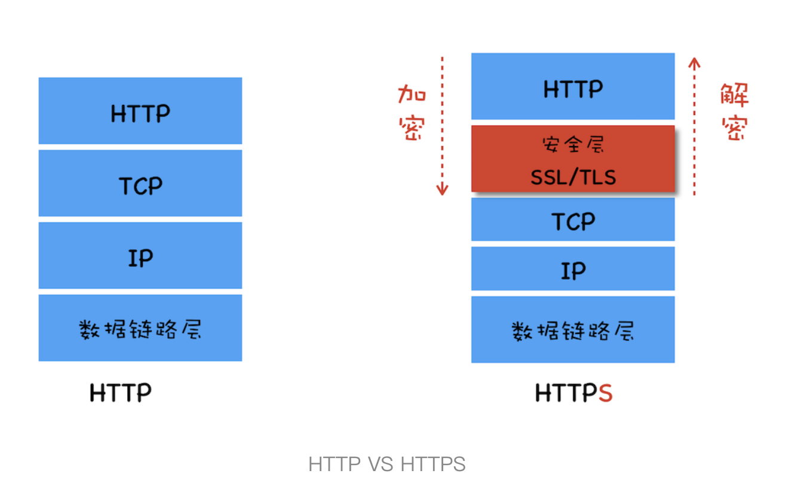
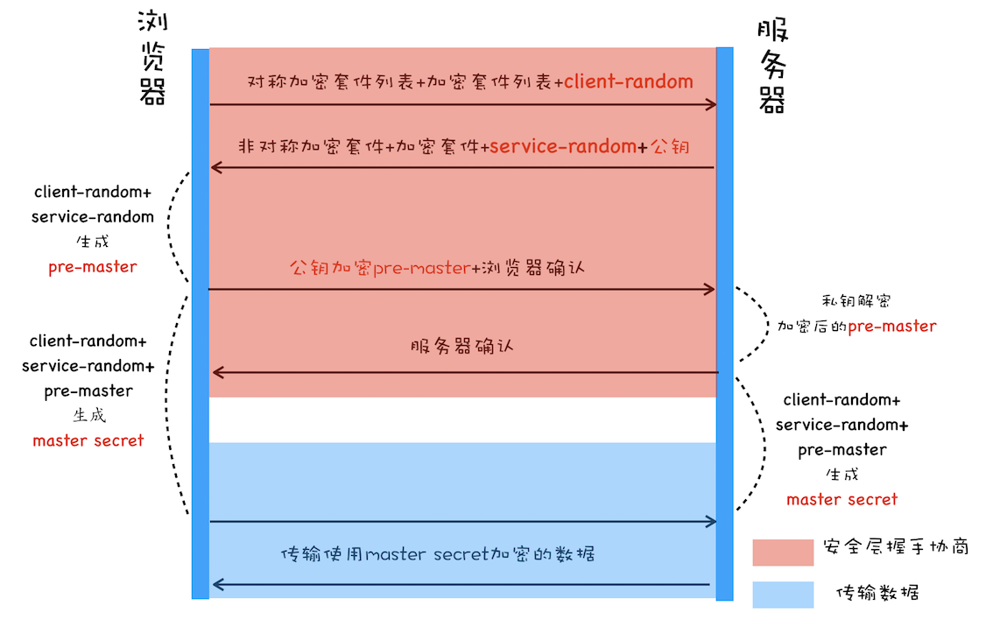

# HTTPS：让数据传输更安全

浏览器安全主要划分为三大块内容：页面安全、系统安全和网络安全。前面我们用四篇文章介绍了页面安全和系统安全，也聊了浏览器和 Web 开发者是如何应对各种类型的攻击，本文是我们专栏的最后一篇，我们就接着来聊聊网络安全协议 HTTPS。

我们先从 HTTP 的明文传输的特性讲起，在上一个模块的三篇文章中我们分析过，起初设计 HTTP 协议的目的很单纯，就是为了传输超文本文件，那时候也没有太强的加密传输的数据需求，所以 HTTP 一直保持着明文传输数据的特征。但这样的话，在传输过程中的每一个环节，数据都有可能被窃取或者篡改，这也意味着你和服务器之间还可能有个中间人，你们在通信过程中的一切内容都在中间人的掌握中，如下图：

从上图可以看出，我们使用 HTTP 传输的内容很容易被中间人窃取、伪造和篡改，通常我们把这种攻击方式称为**中间人攻击**

具体来讲，在将 HTTP 数据提交给 TCP 层之后，数据会经过用户电脑、WiFi 路由器、运营商和目标服务器，在这中间的每个环节中，数据都有可能被窃取或篡改。比如用户电脑被黑客安装了恶意软件，那么恶意软件就能抓取和篡改所发出的 HTTP 请求的内容。或者用户一不小心连接上了 WiFi 钓鱼路由器，那么数据也都能被黑客抓取或篡改。

## 在 HTTP 协议栈中引入安全层

鉴于 HTTP 的明文传输使得传输过程毫无安全性可言，且制约了网上购物、在线转账等一系列场景应用，于是倒逼着我们要引入**加密方案**

从 HTTP 协议栈层面来看，我们可以在 TCP 和 HTTP 之间插入一个安全层，所有经过安全层的数据都会被加密或者解密，你可以参考下图：

从图中我们可以看出 HTTPS 并非是一个新的协议，通常 HTTP 直接和 TCP 通信，HTTPS 则先和安全层通信，然后安全层再和 TCP 层通信。也就是说 HTTPS 所有的安全核心都在安全层，它不会影响到上面的 HTTP 协议，也不会影响到下面的 TCP/IP，因此要搞清楚 HTTPS 是如何工作的，就要弄清楚安全层是怎么工作的。

总的来说，安全层有两个主要的职责：**对发起 HTTP 请求的数据进行加密操作**和**对接收到 HTTP 的内容进行解密操作**

我们知道了安全层最重要的就是加解密，那么接下来我们就利用这个安全层，一步一步实现一个从简单到复杂的 HTTPS 协议。

### 第一版：使用对称加密

提到加密，最简单的方式是使用对称加密。所谓**对称加密是指加密和解密都使用的是相同的密钥**

了解了对称加密，下面我们就使用对称加密来实现第一版的 HTTPS。

要在两台电脑上加解密同一个文件，我们至少需要知道加解密方式和密钥，因此，在 HTTPS 发送数据之前，浏览器和服务器之间需要协商加密方式和密钥，过程如下所示：

通过上图我们可以看出，HTTPS 首先要协商加解密方式，这个过程就是 HTTPS 建立安全连接的过程。为了让加密的密钥更加难以破解，我们让服务器和客户端同时决定密钥，具体过程如下：

- 浏览器发送它所支持的加密套件列表和一个随机数 client-random，这里的**加密套件是指加密的方法**，加密套件列表就是指浏览器能支持多少种加密方法列表。
- 服务器会从加密套件列表中选取一个加密套件，然后还会生成一个随机数 service-random，并将 service-random 和加密套件列表返回给浏览器。
- 最后浏览器和服务器分别返回确认消息。

这样浏览器端和服务器端都有相同的 client-random 和 service-random 了，然后它们再使用相同的方法将 client-random 和 service-random 混合起来生成一个密钥 master secret，有了密钥 master secret 和加密套件之后，双方就可以进行数据的加密传输了。

通过将对称加密应用在安全层上，我们实现了第一个版本的 HTTPS，虽然这个版本能够很好地工作，但是其中传输 client-random 和 service-random 的过程却是明文的，这意味着黑客也可以拿到协商的加密套件和双方的随机数，由于利用随机数合成密钥的算法是公开的，所以黑客拿到随机数之后，也可以合成密钥，这样数据依然可以被破解，那么黑客也就可以使用密钥来伪造或篡改数据了。

### 第二版：使用非对称加密

不过非对称加密能够解决这个问题，因此接下来我们就利用非对称加密来实现我们第二版的 HTTPS，不过在讨论具体的实现之前，我们先看看什么是非对称加密。

和对称加密只有一个密钥不同，**非对称加密算法有 A、B 两把密钥，如果你用 A 密钥来加密，那么只能使用 B 密钥来解密；反过来，如果你要 B 密钥来加密，那么只能用 A 密钥来解密**

在 HTTPS 中，服务器会将其中的一个密钥通过明文的形式发送给浏览器，我们把这个密钥称为**公钥**，服务器自己留下的那个密钥称为**私钥**。顾名思义，**公钥是每个人都能获取到的，而私钥只有服务器才能知道，不对任何人公开**。下图是使用非对称加密改造的 HTTPS 协议：

根据该图，我们来分析下使用非对称加密的请求流程。

- 首先浏览器还是发送加密套件列表给服务器。
- 然后服务器会选择一个加密套件，不过和对称加密不同的是，使用非对称加密时服务器上需要有用于浏览器加密的公钥和服务器解密 HTTP 数据的私钥，由于公钥是给浏览器加密使用的，因此服务器会将加密套件和公钥一道发送给浏览器。
- 最后就是浏览器和服务器返回确认消息。

这样浏览器端就有了服务器的公钥，在浏览器端向服务器端发送数据时，就可以使用该公钥来加密数据。由于公钥加密的数据只有私钥才能解密，所以即便黑客截获了数据和公钥，他也是无法使用公钥来解密数据的。

- **第一个是非对称加密的效率太低**。这会严重影响到加解密数据的速度，进而影响到用户打开页面的速度。
- **第二个是无法保证服务器发送给浏览器的数据安全**。虽然浏览器端可以使用公钥来加密，但是服务器端只能采用私钥来加密，私钥加密只有公钥能解密，但黑客也是可以获取得到公钥的，这样就不能保证服务器端数据的安全了。

### 第三版：对称加密和非对称加密搭配使用

基于以上两点原因，我们最终选择了一个更加完美的方案，那就是**在传输数据阶段依然使用对称加密，但是对称加密的密钥我们采用非对称加密来传输**。下图就是改造后的版本：

**从图中可以看出，改造后的流程是这样的：**

- 首先浏览器向服务器发送对称加密套件列表、非对称加密套件列表和随机数 client-random；
- 服务器保存随机数 client-random，选择对称加密和非对称加密的套件，然后生成随机数 service-random，向浏览器发送选择的加密套件、service-random 和公钥；
- 浏览器保存公钥，并利用 client-random 和 service-random 计算出来 pre-master，然后利用公钥对 pre-master 加密，并向服务器发送加密后的数据；
- 最后服务器拿出自己的私钥，解密出 pre-master 数据，并返回确认消息。

到此为止，服务器和浏览器就有了共同的 client-random、service-random 和 pre-master，然后服务器和浏览器会使用这三组随机数生成**对称密钥**，因为服务器和浏览器使用同一套方法来生成密钥，所以最终生成的密钥也是相同的。

有了对称加密的密钥之后，双方就可以使用对称加密的方式来传输数据了。

需要特别注意的一点，**pre-master 是经过公钥加密之后传输的，所以黑客无法获取到 pre-master，这样黑客就无法生成密钥，也就保证了黑客无法破解传输过程中的数据了**

### 第四版：添加数字证书

通过对称和非对称混合方式，我们完美地实现了数据的加密传输。不过这种方式依然存在着问题，比如我要打开极客时间的官网，但是黑客通过 DNS 劫持将极客时间官网的 IP 地址替换成了黑客的 IP 地址，这样我访问的其实是黑客的服务器了，黑客就可以在自己的服务器上实现公钥和私钥，而对浏览器来说，它完全不知道现在访问的是个黑客的站点。

所以我们还需要服务器向浏览器提供证明“我就是我”，那怎么证明呢？

这里我们结合实际生活中的一个例子，比如你要买房子，首先你需要给房管局提交你买房的材料，包括银行流水、银行证明、身份证等，然后房管局工作人员在验证无误后，会发给你一本盖了章的房产证，房产证上包含了你的名字、身份证号、房产地址、实际面积、公摊面积等信息。

在这个例子中，你之所以能证明房子是你自己的，是因为引进了房管局这个**权威机构**，并通过这个权威机构给你颁发一个**证书**

对于浏览器来说，数字证书有两个作用：一个是通过数字证书向浏览器证明服务器的身份，另一个是数字证书里面包含了服务器公钥。

接下来我们看看含有数字证书的 HTTPS 的请求流程，你可以参考下图：

**相较于第三版的 HTTPS 协议，这里主要有两点改变：**

- 服务器没有直接返回公钥给浏览器，而是返回了数字证书，而公钥正是包含在数字证书中的；
- 在浏览器端多了一个证书验证的操作，验证了证书之后，才继续后续流程。

通过引入数字证书，我们就实现了服务器的身份认证功能，这样即便黑客伪造了服务器，但是由于证书是没有办法伪造的，所以依然无法欺骗用户。

## 数字证书的申请和验证

在第四版的 HTTPS 中，我们提到过，有了数字证书，黑客就无法欺骗用户了，不过我们并没有解释清楚如何通过数字证书来证明用户身份，所以接下来我们再来把这个问题解释清楚。

**如何申请数字证书**

我们先来看看如何向 CA 申请证书。比如极客时间需要向某个 CA 去申请数字证书，通常的申请流程分以下几步：

- 首先极客时间需要准备一套私钥和公钥，私钥留着自己使用；
- 然后极客时间向 CA 机构提交公钥、公司、站点等信息并等待认证，这个认证过程可能是收费的；
- CA 通过线上、线下等多种渠道来验证极客时间所提供信息的真实性，如公司是否存在、企业是否合法、域名是否归属该企业等；
- 如信息审核通过，CA 会向极客时间签发认证的数字证书，包含了极客时间的公钥、组织信息、CA 的信息、有效时间、证书序列号等，这些信息都是明文的，同时包含一个 CA 生成的签名。

这样我们就完成了极客时间数字证书的申请过程。前面几步都很好理解，不过最后一步数字签名的过程还需要解释下：首先 CA 使用**Hash 函数**来计算极客时间提交的明文信息，并得出**信息摘要**；然后 CA 再使用它的私钥对信息摘要进行加密，**加密后的密文就是 CA 颁给极客时间的数字签名**。这就相当于房管局在房产证上盖的章，这个章是可以去验证的，同样我们也可以通过数字签名来验证是否是该 CA 颁发的。

## 浏览器如何验证数字证书

有了 CA 签名过的数字证书，当浏览器向极客时间服务器发出请求时，服务器会返回数字证书给浏览器。

浏览器接收到数字证书之后，会对数字证书进行验证。首先浏览器读取证书中相关的明文信息，采用 CA 签名时相同的 Hash 函数来计算并得到**信息摘要 A**；然后再利用对应 CA 的公钥解密签名数据，得到**信息摘要 B**；对比信息摘要 A 和信息摘要 B，如果一致，则可以确认证书是合法的，即证明了这个服务器是极客时间的；同时浏览器还会验证证书相关的域名信息、有效时间等信息。

这时候相当于验证了 CA 是谁，但是这个 CA 可能比较小众，浏览器不知道该不该信任它，然后浏览器会继续查找给这个 CA 颁发证书的 CA，再以同样的方式验证它上级 CA 的可靠性。通常情况下，操作系统中会内置信任的顶级 CA 的证书信息（包含公钥），如果这个 CA 链中没有找到浏览器内置的顶级的 CA，证书也会被判定非法。

**另外，在申请和使用证书的过程中，还需要注意以下三点：**

- 申请数字证书是不需要提供私钥的，要确保私钥永远只能由服务器掌握；
- 数字证书最核心的是 CA 使用它的私钥生成的数字签名；
- 内置 CA 对应的证书称为根证书，根证书是最权威的机构，它们自己为自己签名，我们把这称为自签名证书。